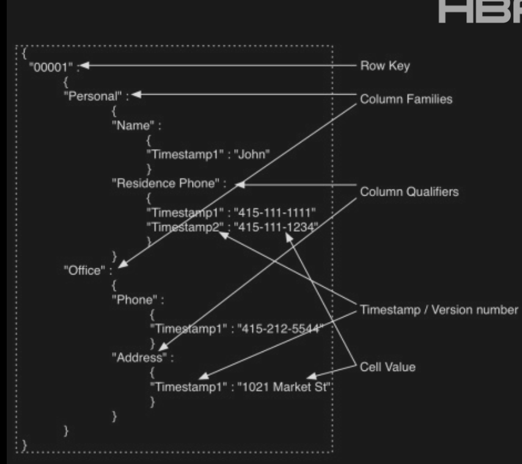
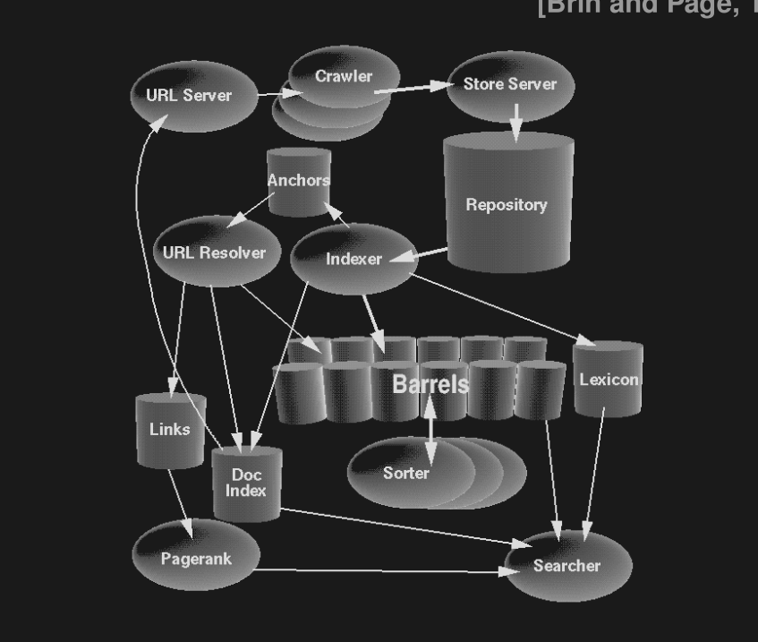
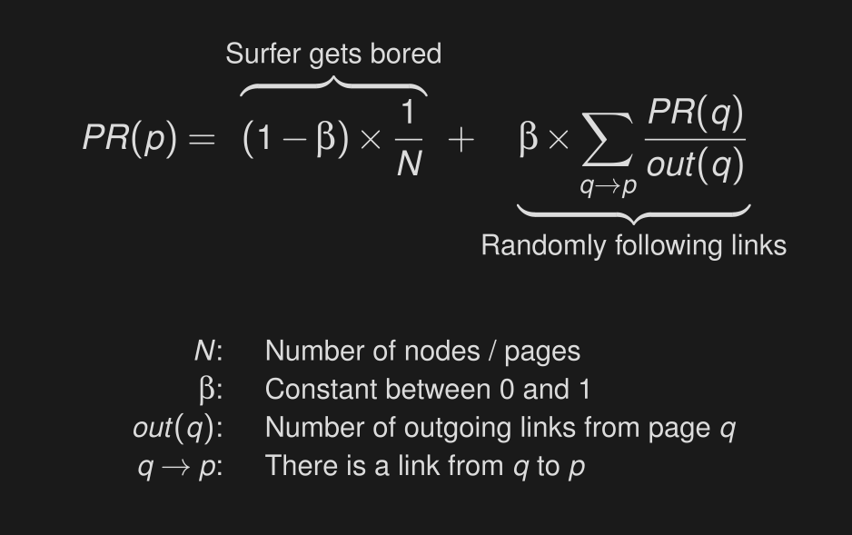

## Big Data

- BigData - large and Complex set of data
- 3Vs - Volume, Velocity, Variety
- 1024 - Kilo, Mega, Giga, Tera, Peta, Exa, Zetta, Yotta, Bronto, Gepo - 1024^24
- 147ze - 2024, 181ze - 2025 
- activity, conversation, sensor,  photo video, IoT, satellite

- **Characteristics**: 
- Volume(too big), Variety(too complex) Velocity(too fast)  Veracity(uncertain) Value(into Money)
- nil -> 2008 (every two minute now)
- Use Cases

- Data Science (Processes)
- TDSL (Team DataScience LifeCycle), CRISP-DM (Cross-Industry Standard Process for Data mining), KDD (Knowledge Discovery in Database)
- Business understanding - Data Acquisition & understanding - Deployment (if accept else) - Modeling - loop
1. Measurement Scales
    - **INTERVAL** - fixed and defined interval like time or temperature
    - **ORDINAl**  - scores from questionnaire
    - **NOMINAL for order**  -  Mild, Moderate, Severe
    - **NOMINAL without order**  -  Color of an eye 
    - **DICHOTOMOUS**  -  Nominal but only two classes male and female  

    - Data is **CATEGORICAL(qualitative)** or **NUMERICAL(quantitative)**
2. Data exploration and Visualization - EDA, Trends, Corelation, Outliers
    - Histogram - for continuous numerical data (Bar is for discrete)
    - Box plot - whisker Mean Outliers (Grey line in mean - median)
    - LineGraphs - Useful for spikes / trends
    - ScatterPlot - correlation  

- Correlation  != Causation 
3. Prepare Data
   - Data Preprocessing: clean, inconsistent, duplicate, missing, invalid, Outliers
   - Cleaning Data: Fix, remove replace, leave
   - Munging, Wrangling, Preprocessing, Manipulation
   - Dimensionality Reduction, Transformation, feature selection, scaling
4. Data analysis
   - Technique Selection - Classification, Regression, Clustering, Graph Analytics, Association
5. Communicate Results - PowerBI, Tableau, Google Charts

- TES - Transform Explore Summarize

### NO-SQL dbs

- Vertical Scaling and Horizontal Scaling
    - Vertical- you add in more resources to single machine
    - Horizontal- you add in more machines
- SQL cannot be horizontally Scaled ? 
- HTML, JSON, XML are semi-structured ? 
- Not only SQL
- There are more unstructured data 
- Data Models - Describe Characteristics, a table in SQL
    - when not all records have the same structure
    - Cassandra, MongoDB, HBase
- Types
    - Key Value: Value is Blob, Redis, BarkleyDB, HamsterDB, DynamoDB
    - Document: Stores and retrieves docs XML, BSON, JSON
    - Column: Many Cols associated with row key, rows with different cols ? Cassandra, HBase, Hypertable
        - ```
            Users
               ├── Profile Family ( like a table )
               ├── Activity Family
               └── Preferences Family
            ```
    - Graph: persisted relationships - like Neo4j, Infinite Graph (Nodes, Edges) time-trees, quad-trees
- Choosing
     - Key Value - query by data, session info Preferences, profile
     - Document - unstructured data like blog, content, analytics, ecom, no need of txn
     - Column Family - faster aggregations ? massive scale + fast predictable reads/writes on known query patterns
     - Graph - relationships, connected data 

### MongoDB

- MongoDB 
    - DB, Collection(Table), Document(Row), Key Value/Field(Columns)
    - Collection creation is automatic
    - BSON - Binary JSON
    - ObjectId - Unique identifier for document, System generated, can also be user defined
        - 12 bytes - 4 byte timestamp, 5 byte random val, 3 byte incrementing counter (initialized to random val)
    - ```js
        // show stuffs
        // show collections
        // show dbs

        // create
        db.createCollection('depts', { max: 20 }) 
        // db.collectionName.insertOne
        // db.collectionName.inserteMany([])
        db.collectionName.insert({
            key: "value"
        })

        // queries
        db.collectionName.find({ "name" : "rokshh" }).pretty() // everything is case sensitive by default
        db.emp.find({ hiredate: { $lt: new Date("2000-01-01") }})
        db.collectionName.findOne()

        // update
        db.collectionName.update({ 'name': 'rokshh' }, { $set: { "loc": "Nepal" }})
        // UPDATE student SET loc = "Nepal" WHERE name = "rokshh"
        db.collectionName.updateOne()
        db.collectionName.updateMany([])
        db.collectionName.replaceOne()
        
        // count and distinct
        db.collectionName.distinct("name")

        db.collectionName.replaceOne()

        // sql 
        INSERT into TABLE (row, names) VALUES (val, names)

      ```

- aggregations
    - `stages` - pass the output to other stage
    - `Filter → Transform → Group → Sort → Limit`

    -  `$group` -  similar to `GROUP BY` 
    -  `$count` -  similar to `COUNT(*)` `{ $count: "totalUsers" }`
    -  `$sort` -  sorts `{ $sort: { age: -1 } }` 
    -  `$limit`, `$skip` 
    -  `$unwind` - break arrays to individual comp
    -  `$lookup` - like `JOINS`  `from: "orders", localField: "_id", foreignField: "userId", as: "orders"`
    -  `$addFields` -  add computed Fields 
    -  `$set` -  alias for `addFields`, `$unset`  remove
    -  `$facet` - multiple pipeline in parallel 
    - ```js
         $facet: {
            stats: [{ $count: "total" }],
            topUsers: [{ $sort: { score: -1 } }, { $limit: 5 }]
          }

         // { $filter: {
         //     input: <array>,
         //     as: <string>,
         //     cond: <expression>
         // }}

         // pattern matching
         // { <field>: { $regex: /pattern/, $options: '<options>' } }
         // or /sal/i - /regex/<options>
         // i - insensitive - m ^ $, x extended(ignore whitespace), s(allow dot character)

         // top 5 countries by active users
         {
             $match: { status: active },
             $group: { _id: "$country", total: { $sum: 1 }},
             $sort: { total: -1 } ,
             $limit: 5
         }

         // SQL for this would be
         SELECT country COUNT(*) as total
         FROM countries 
         WHERE status = "active" 
         GROUP BY country 
         ORDER BY total "asc"
         LIMIT 10 

        ```

- nested docs
  - `db.dept.find({ "employees.sal": { $gt: 2000 }})` 

- indexs
 - on querying large dbs indexs improve performance
 - `db.emp.createIndex({ ename: "text" })`
 - `db.emp.find({$text : {$search : “scott"}})` - if you want to use that index in mongo, in SQL its default
 - `db.emp.getIndexes()`
 - `db.emp.dropIndex()`

- `polygot persistance` - persistence across different dbs
-  NoSQL vs RDBMS ? scalability, rigid schemas, JOINS, `ACID`

### Hadoop

- OSS - distributed storage and processing
    - GFS - Google File System build for distributed
    - Google MapReduce - programming paradigm for parallelization
- Nutch Web Crawler Prototype Doubg Cutting - hadoop

- Modules
  - H Common - Shared programming libs
  - HDFS (Hadoop File System) - Java based FS
  - MapReduce  - process data in parallel
- Data Processing
- Data Processing
    - Spark - in memory distributed processing engine (batch and stream)
    - Hive  - SQL like interface to query large datasets in Hadoop
    - Pig - Scripting lang for data Transformation workflow
- Data Ingestion
    - Sqoop - transfer bulk data bet. SQL db and Hadoop
    - Flume - collect and stream log data into Hadoop (Realtime)
    - Kafka - Distrubted Event streaming for high throughput data pipeline
- Data Storage and Formats
    - Hbase - Column Family Db on top of HDFS
    - Avro - Data Serialization Format
    - Parquet - format for anaytic query
- workflow and coordinators
    - zookeeper - coordination service to manage config and sync
    - oozie - workflow schedular
    - mahout - ML library

- HDFS 
 - NameNode  - metadata about stored files, fs operation, map data block : DataNodes
 - DataNode  - handle file read and write request, loop asking namenode for instruction 
    - 1 datablock - 64 mb (typically) 
 - MapReduce - Map - takes input pair, produces intermediate pair - reduce accepts em and values and merges 
 - `Input - Splitting - Mapping - Shuffling - Reducing - Write to file`
 - in hadoop - `MapReduce` is java program packaged to jar and ran through - compile convert run
 - `Mapper<KeyIn, ValueIn, KeyOut, ValueOut>`
 - `Reducer<KeyIn, ValueIn, KeyOut, ValueOut>`
 - `IntWritable` - numeric, `Text` - String
 - `hdfs dfs -thing`

- YARN (Yet Another Resource Negotiator)
 - Resource Manager - global service: receive and run applications
 - JobHistory Server  - logs of all finished jobs
 - NodeManger - See resource consumption on node 
```
  Client -(run my program)-> Resource Manager
  Client -(How's it going)-> Resource Manager -(tell me)-> Node Manager
  Client <-(It has started check on this application master)- Resource Manager <-(started)- Node Manager
```

### SQL on Hadoop

- MapReduce is complex
- SQL on Hadoop - Hive, Pig, HBase, Spark
- HBase - inspired by Google Big table, Column Family DB
 - only batch processing, access in sequential manner
 - ColumnFamily:Qualifier - name:first
- 
 - `put 'users' 'seppe' 'email:work' 'value@gmail.com'`
 - `get 'users' 'seppe'`
 - table partitioned to regions, managed by region server
 - Memstore - write buffer, HFile, new file on every flush
 - best when more than 5 data nodes


- Pig - Google, Apache Pig, PigLatin resembles query of SQL
 - java ewwwww so pig neww 
 - pig latin is procedural vs Declarative SQL
 - runtime engine - converts DAG to MapReduce
 - pig operation - parser, optimizer, compiler | execution of plan
 - atom, tuple(Rob, 5), bag {(rob, 5)}, map[name # rohit] | nestable data model
 - **local mode** - linux file system, **MapReduce Mode** - HDFS
 - Interactive, Batch, Embedded

- Hive - initially By Facebook 
 - Data warehouse solution 
 - SQL like queries to `MapReduce` 
 - `JDBC` and `ODBC` interfaces, on top of HDFS or other FS
 - `parse -> optimize -> execute -> submit cluster -> monitor -> process in MapReduce -> Store in HDFS` 

- Hive
 - `Query - Driver - AST - DAG - MapReduce stages`
 - `HiveQL` - doesn't follow full `SQL-92` standard
 - Hive doesn't enforce schema when loading data

- Apache Spark
    - around DS `RDD (Resilient Distributed Dataset)`
    - `master-slave` architecture
    - RDD each dataset - logical partitions
    - on HDFS, requires Spark Core, Spark SQL, MLib and GraphX
    - **Core**: chain of RDD operations compiled by Spark to DAG - then Distrubted | mem manage, fault rec
    - **SparkSQL**: on top of Core, introduces **Dataframes**
    - pyspark, spark-shell(scala), spark-sql, spark-submit
    - **GraphX** - Graph Computation Engine
    - load - `sc.textFile("name")`, `.flatMap(lambda line: line.split(" ")).map(lambad word: (word, 1)).reduceByKey(lambda a, b: a + b)`

```js
df = spark.read.json("students.json")
df.show()
df.printSchema()
df.select("name").show()
df.select(df['name'], df['age'] + 1).show()
df.select(df['age'] > 21).show()
df.groupBy("course").count().show()

// SQL 
df.createOrReplaceTempView("student")
spark.sql("SELECT SQL here")
```

- MLIB - ML library on spark

### Indexing and searching in bigData

- raw text - structured format - index
- searching - take the index and search for word
- inverted index - terms pointing to doc
- `indexWriter, Document(storage location of index), Analyzer(get tokens), Field, Directory` 
- `StandaradAnalyzer- does all kind of shits like stem, whitespace, non-alphanumeric`
- `new TermQuery(new Term("hello")); searcher.search(query, 10)`  

- Field - lowest or starting point of indexing
- lucene - used to index data
  - indexer - field - documents - IndexWriter - Index
  - searchManager - QueryParser - Query - IndexSearcher - HIT

- **ElasticSearch** uses lucene for making inverted Index
- index - Document - Field
- `Content Acquisition - Build Document - Document Analysis - Index Doc` 

### Web Information Retrieval

- Web Bowtie Structure: 
   - IN -> CORE(Strongly Connected Components) -> OUT
   - IN (Pages that can reach SCC)  | OUT (Pages that can reached from SCC) 
   - tendrils - cannot be reached

- Web Search Taxonomy
 - Navigational: to reach particular site
 - Informational: acquire information present on website
 - Transactional: find pages where further interaction happen
 - Resource: get access to online resource 

- problems: exponential info growth, vanishing docs, heterogen doctype, doc quality, multilinguality
- Hierarchical Category Scheme (DMOZ) Open Directory Project
- Web is a jungle - sergey brin


- anatomy
- 
- `URL Server` - collect URLs from document index -> crawler
- `Crawler`- collect and access website (Apache Nutch)
- `Store server` - compress, store them in repo, assign ID
- `Indexter` - read repo, decompress, parse, enrich with `Hit terms`
    - Hits are (partially)sorted into `barrels`
    - imp info in `anchor` file, maintain `lexicon` of all words
- `URL Resolver` - Read anchor, convert to abs URL and doc ID
- `Sorter` - `inverted list` from and to barrel
- `Page Rank`
- `Searcher` - process search request: use PageRank, InvertedList, and lexicon

- Fancy Hit(meta, title, URL), Anchor Hit(anchor text linking to page) and Plain Hit
- dot product type weight vector (dot) count weight vector, `RSV (Retrieval Status Value)`
- Hypertext is a set of vertices (nodes) and directed edges (links) forming a graph.
- `RSV∗ (d , q ) = α RSV (d , q ) + (1 − α) PR (d )`
- Random Surfer Model
- _second part_: probability that the user reaches p from another page q linking to p.
- comp independent from query, popular pages, home page search, possible manipulation with link farms



- **Kleinberg's Hits Algo**
- Hub(Links to good authority) and Authority(many links from good hub)
- HITS (Hyperlink-Induced Topic Search)

- Authorities are the content sources.
- Hubs are the guides/directories.

```txt
        Hub Page
      (resource list)
             |
      ----------------
      |              |
Authority 1     Authority 2
(course page)   (research page)
```

| Aspect                 | PageRank                      | HITS                                               |
| ---------------------- | ----------------------------- | -------------------------------------------------- |
| Purpose                | Global importance ranking     | Topic-specific ranking                             |
| Scores per page        | One score                     | Two scores (hub + authority)                       |
| Query dependence       | Query-independent             | Query-dependent                                    |
| Computation            | Precomputed offline           | Computed at query time                             |
| Uses outgoing links?   | Mostly incoming link prestige | Explicitly models both incoming and outgoing links |
| Interpretation         | Popularity/prestige           | Expert-directory relationship                      |
| Susceptibility to spam | Lower                         | Higher                                             |
| Typical use            | Search engine ranking         | Focused topic/community discovery                  |


## From Sample Question

- OLAP (Online Analytical Processing) - analyzes data, ClickHouse, Google BigQuery
- OLTP (Online Transaction Processing) - stores data/ Transactions, PostgreSQL, 

- Yet Another Resource Negotiator
- OR is simply union if done without ranking (`q * d`)
- Posting List are in sorted order
- correlation 0 - no linear relationship
- lemmatization - vocab + lingustic analysis | stemming - only prefix suffix with rules
- Secondary Name Node - assists by merging fsimage and edit logs periodically
- `"date": new Date('1998-06-09')`
- mapReduce - processes Input data and generates key value pairs
- `Sqoop` - used for  data transfer bet RDBMS and hadoop
- HDFS stores large datasets across clusters, MapReduce processes the data in parallel, and Hive provides a SQL-like interface for querying data
- HBase - performs when deployed on at least 6-10 nodes 
- `Elastic Search `: Indexes containing documents for fast search retrieval
- `Application Master`: Coordinate execution of a specific application
- According to Eric Schmidt - 5 EB of data in 2 days
- fundamental unit in apache spark - RDD (Resilient Data)
- Map -> Shuffle and Sort -> Reduce
